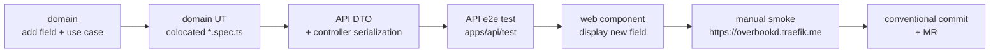

# 4. Your first feature

> _What this page covers:_ A guided walk through every layer of the codebase, using a tiny end-to-end change as the running example.
> _Who it's for:_ A new contributor about to ship their first MR.

The goal of this page is **not** to give you a copy-paste recipe — it's to make you walk through every layer once, so you know where things live. After this you'll know enough to find your way through any ticket.

## The example

> Add a new read-only field `displayName` on a festival activity. It returns the activity's name, prefixed with its team's short name, e.g. `"FOOD — Crêpes party"`. Surface it in the API response and show it on the web detail page.

This is contrived on purpose. It changes one type, one use case, one DTO, one controller response shape, one web component, and adds tests at every layer. You won't ship this — you'll change something else for a real ticket — but the **shape** of the work is the same.

## The journey

We'll go: **domain → unit test → API → API e2e test → web → manual smoke → commit → MR**.



## Step 1 — Domain

Open the relevant domain. For our example, `domains/festival-event/src/festival-activity/`.

A domain change typically touches:

- The aggregate type (`festival-activity.ts` or similar) — add the field to the readable shape.
- A use case folder (e.g. `preview-of/`) — wire the new field where it's computed.
- A factory (`*.factory.ts`) and the fake (`*.fake.ts`) — keep test doubles in sync.

**Rules:**
- Don't import from `apps/`, `utils/`, or anything outside `domains/`, `libraries/`, `constants/`. ESLint enforces it.
- If you need a constant, it goes in `constants/<scope>-constants/`.
- If you need pure utility logic (e.g. string slugify), use or extend `libraries/`.

## Step 2 — Unit test (mandatory)

Domain code without a UT is a bug. Write the test **first** if you can — see [`docs/04-conventions/testing.md`](../04-conventions/testing.md).

```ts
// domains/festival-event/src/festival-activity/preview-of.spec.ts
import { describe, it, expect } from "vitest";
// ...
describe("festival activity preview", () => {
  it("prefixes the displayName with the team short name", () => {
    // arrange / act / assert
  });
});
```

Run only this package's UTs while iterating:

```bash
pnpm --filter @overbookd/festival-event run test:unit -- preview-of
```

## Step 3 — API

Open `apps/api/src/festival-event/`. You will likely touch:

- A DTO (`*.dto.ts`) — declare `displayName: string` and add `@ApiProperty()` so Swagger picks it up.
- A controller (`*.controller.ts`) — make sure the response includes the new field.
- A repository / mapper, if the field needs persistence (it doesn't, here).

The controller never contains business logic — it validates input, calls a use case, serializes the result. If you find yourself writing an `if` in a controller, the logic belongs back in the domain.

## Step 4 — API e2e test

`apps/api/test/` runs Jest e2e tests against the real Nest app + a test database. Add (or extend) a `*.e2e-spec.ts` that hits the endpoint and asserts the response includes the new field.

```bash
pnpm --filter @overbookd/api run test:e2e -- --testNamePattern="festival activity"
```

## Step 5 — Web

Find the page in `apps/web/pages/` that displays festival activity details. Trace down:

```text
pages/<...>/[id].vue        # the page
  → components/...           # the component that renders the activity
    → composable/use*.ts     # the composable that loads it
      → stores/*.ts          # the store
        → repositories/*.ts  # the API client wrapper (typed)
```

Add the new field to:
- the type used by the repository / store (likely mirrored under `apps/web/domain/`),
- the component template that renders the activity.

Run the web devtools / browser to check it:

```bash
pnpm dev:logs                                    # watch for HMR rebuilds
# open https://overbookd.traefik.me
```

If TypeScript complains in `apps/web`, run:

```bash
pnpm --filter @overbookd/web run lint
```

## Step 6 — Manual smoke

Before opening an MR, _use_ the feature in the browser. Type checks and unit tests verify code correctness, not feature correctness — only your hands clicking through the UI verify the latter. Check:

- The golden path (happy case).
- One edge case (e.g. activity with no team).
- That nothing else broke (spot-check a neighboring feature).

## Step 7 — Commit and open an MR

This repo uses **Conventional Commits** enforced by a pre-commit hook. Allowed types are documented in [`docs/04-conventions/commits-and-branches.md`](../04-conventions/commits-and-branches.md).

```bash
git checkout -b feat/festival-activity-display-name
git add .
git commit -m "feat(festival-event): add displayName on festival activity"
git push -u origin HEAD
```

Open the MR on GitLab. The MR template (`.gitlab/merge_request_templates/auto-asign.md`) is auto-applied — fill in the issue link and tick the "Updated /docs if relevant" checkbox.

The CI pipeline (`.gitlab-ci.yml`) runs lint + UTs + API e2e. Reviewers expect:
- Tests at the right layer ([testing.md](../04-conventions/testing.md)).
- No imports that violate the dependency hierarchy.
- A small enough diff to read in one sitting.

## You did it

That's the loop. Every feature you'll work on is a variation of this shape — sometimes you'll skip the web layer (pure API change), sometimes you'll skip the domain (UI-only tweak), but the layering is always the same.

## See also

- [`docs/04-conventions/adding-a-domain.md`](../04-conventions/adding-a-domain.md) — when a feature warrants a brand-new bounded context
- [`docs/04-conventions/adding-an-api-endpoint.md`](../04-conventions/adding-an-api-endpoint.md)
- [`docs/04-conventions/adding-a-web-page.md`](../04-conventions/adding-a-web-page.md)
- [`docs/04-conventions/merge-requests.md`](../04-conventions/merge-requests.md)

---

_Last reviewed: 2026-05_
