# API anatomy

> _What this page covers:_ How `apps/api` is wired — NestJS modules, controllers, DTOs, and the bridge to domain use cases.
> _Who it's for:_ Anyone adding or modifying an HTTP endpoint.

## The big picture

```mermaid
flowchart LR
    HTTP[HTTP request<br/>browser / curl] --> Traefik
    Traefik --> Nest[NestJS app<br/>main.ts → AppModule]
    Nest --> Slice[Slice module<br/>e.g. festival-event.module.ts]
    Slice --> Ctrl[Controller<br/>routes + DTO validation]
    Ctrl --> UseCase[Domain use case<br/>@overbookd/&lt;domain&gt;]
    UseCase --> Repo[Repository / port<br/>defined by the domain]
    Repo --> Prisma[Prisma client]
    Prisma --> PG[(PostgreSQL)]
```



Two important rules:

1. **Controllers contain no business logic.** They validate input, call a use case, serialize the result.
2. **Domains know nothing about NestJS.** They define **ports** (interfaces) that are implemented by **adapters** (Prisma repositories) wired in the slice module.

## Top-level layout

```text
apps/api/src/
├── main.ts                 # Bootstrap — Nest factory, global pipes, Swagger setup
├── app.module.ts           # Root module — imports every slice
├── app.controller.ts       # Health-check endpoint
├── app.service.ts
├── api-swagger-response.decorator.ts
├── http-exception.filter.ts # Global error → HTTP mapping
├── period.filter.ts
├── prisma/                 # Prisma schema + migrations + seed
│   ├── schema.prisma
│   ├── migrations/
│   ├── seed.ts
│   └── seeders/
├── generated/              # Prisma-generated client (do not commit edits)
└── <slice>/                # One folder per slice — see below
```

`apps/api/src/app.module.ts` imports every slice module — that file is the canonical index of what the API exposes.

## Anatomy of a slice

A slice mirrors a domain (or a thin orchestration over several). For example, `apps/api/src/festival-event/`:

```text
festival-event/
├── festival-event.module.ts        # Wires controllers + repositories + DI
├── festival-activity.controller.ts # @Controller("festival-activities")
├── festival-task.controller.ts
├── dto/
│   ├── create-festival-activity.dto.ts
│   ├── update-festival-activity.dto.ts
│   └── ...
├── repository/                     # Adapters implementing the domain's ports
│   ├── prisma-festival-activity.repository.ts
│   └── ...
└── ...
```

### The module

```ts
@Module({
  imports: [PrismaModule, /* other dependencies */],
  controllers: [FestivalActivityController, FestivalTaskController],
  providers: [
    PrismaService,
    {
      provide: FESTIVAL_ACTIVITIES,                       // domain port
      useFactory: (prisma) => new PrismaFestivalActivities(prisma),
      inject: [PrismaService],
    },
    /* other ports → adapters */
  ],
})
export class FestivalEventModule {}
```

The module's only job is **dependency wiring**. The pattern: domain defines a port (an interface); the slice supplies a Prisma-backed adapter.

### The controller

```ts
@Controller("festival-activities")
@UseGuards(JwtAuthGuard, PermissionsGuard)
@ApiTags("festival-event")
export class FestivalActivityController {
  constructor(@Inject(FESTIVAL_ACTIVITIES) private readonly activities: FestivalActivities) {}

  @Post()
  @Permission(WRITE_FA)
  @ApiBody({ type: CreateFestivalActivityDto })
  create(@Body() dto: CreateFestivalActivityDto, @Request() req): Promise<FestivalActivity> {
    return this.activities.create({ ...dto, instigator: req.user });
  }
}
```

Things to notice:

- **Decorators document and enforce.** `@ApiBody`, `@ApiResponse`, `@Permission` aren't decoration — they generate Swagger and enforce auth.
- **Auth is module-wide via guards** plus per-route `@Permission(...)` referencing a constant from `@overbookd/permission`. See [`docs/03-business/domains/access-manager.md`](../03-business/domains/access-manager.md).
- **No `try/catch` in controllers.** Domain errors are translated globally by `http-exception.filter.ts`.
- **Async return.** Controllers return whatever the use case returns; Nest serializes via class-transformer.

### The DTO

```ts
export class CreateFestivalActivityDto {
  @ApiProperty({ description: "Activity name" })
  @IsString()
  @MinLength(3)
  name: string;

  // ...
}
```

DTOs are the **boundary type** between HTTP and the domain. They use `class-validator` decorators for runtime validation and `@nestjs/swagger` decorators for OpenAPI generation. They are **not** the domain type — convert at the controller boundary.

### The repository (adapter)

```ts
export class PrismaFestivalActivities implements FestivalActivities {
  constructor(private readonly prisma: PrismaService) {}

  async findById(id: number): Promise<FestivalActivity> {
    const row = await this.prisma.festivalActivity.findUnique({ where: { id }, include: { ... } });
    return mapToDomain(row);
  }
  // ...
}
```

Two responsibilities:

1. **Map Prisma rows to domain types** at the boundary. The domain never sees Prisma types.
2. **Implement the domain's port interface** so use cases can be unit-tested with a fake instead of Prisma.

## Swagger

Swagger UI is served at [`https://overbookd.traefik.me/api/swagger`](https://overbookd.traefik.me/api/swagger) when the dev stack is running. Generation happens at startup from `@ApiTags`, `@ApiBody`, `@ApiResponse`, etc. Decorate your endpoints — your future self and the front-end team will thank you.

## Authentication and authorization

Auth is JWT-based. The flow is in `apps/api/src/authentication/`. Permission checks are decorator-driven (`@Permission("write:fa")`), enforced by `PermissionsGuard`, and resolved against the `access-manager` domain.

A request without auth returns `401`. A request with auth but missing a permission returns `403`.

## Tests

| Where | Stack | What to test |
|---|---|---|
| `apps/api/src/<slice>/*.spec.ts` | Vitest | Controller-level logic when it's worth it (rare — push to domain UT) |
| `apps/api/test/*.e2e-spec.ts` | Jest + supertest | The HTTP boundary: real Nest app, real DB, real auth |

The split is on purpose: heavy logic lives in `domains/` and is tested there with fakes; the e2e suite verifies the wiring is correct.

```bash
pnpm --filter @overbookd/api run test:e2e
pnpm --filter @overbookd/api run test:e2e -- --testNamePattern="login"
```

## Recipes

- Adding an endpoint → [`docs/04-conventions/adding-an-api-endpoint.md`](../04-conventions/adding-an-api-endpoint.md)
- Adding a domain → [`docs/04-conventions/adding-a-domain.md`](../04-conventions/adding-a-domain.md)

## See also

- [`docs/02-architecture/data-model.md`](./data-model.md)
- [`docs/02-architecture/request-lifecycle.md`](./request-lifecycle.md)

---

_Last reviewed: 2026-05_
