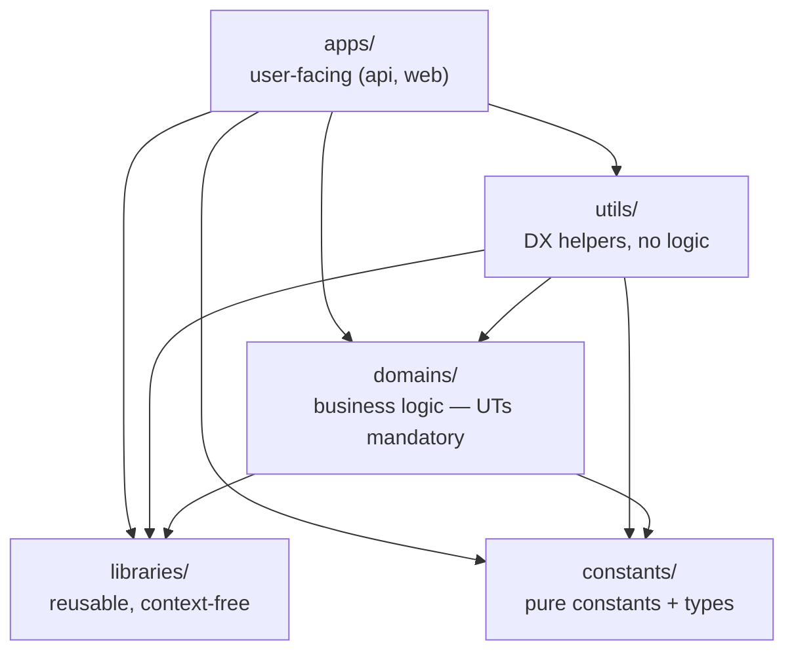

# Dependency hierarchy

> _What this page covers:_ The strict layering between top-level folders, what each layer can import, and why.
> _Who it's for:_ Anyone introducing a cross-folder import.

The split between top-level folders is **deliberate and load-bearing**. It is the spine of the codebase — once you internalize it, most of the repo organizes itself in your head.

## The five layers

Read each arrow as **"can import from"**. The graph is a DAG; no cycles allowed.

## What each layer is for

### `constants/`
Pure constants and the types describing them, scoped per business context. No logic, no tests.

> Why scoped per context? Because the meaning of a "volunteer" is different in `registration` vs. `assignment`. Each context owns its own constants so name collisions stay safe.

**Cannot import anything** — not even other `constants/`. Each constants package is a leaf.

### `libraries/`
Reusable, context-free logic: `csv`, `time`, `money`, `list`, `slugify`, `geo-location`, `pdf-book`, `event`. The kind of code you'd publish on npm if you had to.

**Cannot import anything**, not even `constants/`. This rule keeps libraries pure — they can't accidentally absorb business assumptions.

A library may have its own UTs, but its real-world usage is exercised by the domain UTs that call it.

### `domains/`
The business logic of the festival. Each top-level folder under `domains/` is a **bounded context** (DDD term) — its own ubiquitous language, its own model. They are independent of each other.

A "volunteer" in `assignment/` is not the same shape as a "volunteer" in `registration/`. That's intentional. If you find yourself sharing a type across two domains, it should probably live in `libraries/` (if it's generic) or each domain should keep its own (if it isn't).

**Can import from `constants/` and `libraries/`.** Cannot import from other `domains/`, from `utils/`, or from `apps/`.

UTs are **mandatory** here — see [`docs/04-conventions/testing.md`](../04-conventions/testing.md). If your domain change has no UT, the MR is incomplete.

### `utils/`
Developer-experience helpers used by `apps/`: alerts, configuration, domain-events, http, team, user. Convenience wrappers and adapters. **No business logic.**

**Can import from `constants/`, `libraries/`, and `domains/`.** No tests required (because no logic).

### `apps/`
The two user-facing applications: `apps/api` (NestJS) and `apps/web` (Nuxt 4 SPA). Anything that talks to a real user or a real database lives here.

**Can import from anything below.** No app may import from another app — `apps/api` cannot reach into `apps/web` and vice versa.

This is also the only layer that has integration / e2e tests in addition to UTs.

## What enforces the rules

| Mechanism | What it catches |
|---|---|
| `tsconfig.all-modules-import.json` and `tsconfig.cross-modules-import.json` | TypeScript path resolution for cross-package imports — wrong layer = compile error |
| Workspace package names (`@overbookd/<x>`) | Imports must go through the package name, not relative `../../`. Makes the layer explicit at the call site |
| ESLint config (`eslint.config.mjs`) | Style + prevention of bad imports |
| `pnpm prune` (ts-prune) | Unused exports across the graph |
| Code review | The human backstop — reviewers can spot a violation that slipped through tooling |

## Adding a cross-folder import — the checklist

Before you write `import { ... } from "@overbookd/<other-package>"`:

1. **Which layer is each side?** Look at the folder.
2. **Does an arrow exist between them in the diagram above?** If no, you can't import. If yes, proceed.
3. **Is the imported thing in the right layer?** A "constant" that has logic isn't a constant — promote it to `libraries/` or push it back into the calling domain.
4. **Will this create a cycle?** `domains/A` importing from `domains/B` is forbidden, full stop. If you genuinely need it, the shared concept is probably a library.

When in doubt, ask in code review — the team has been refining these boundaries for years.

## See also

- [`docs/02-architecture/domain-driven-layout.md`](./domain-driven-layout.md) — anatomy of a domain folder
- [`docs/04-conventions/adding-a-domain.md`](../04-conventions/adding-a-domain.md) — recipe for a brand-new bounded context
- [`domains/README.md`](../../domains/README.md), [`libraries/README.md`](../../libraries/README.md), [`apps/README.md`](../../apps/README.md), [`constants/README.md`](../../constants/README.md), [`utils/README.md`](../../utils/README.md) — folder-level summaries (in French)

---

_Last reviewed: 2026-05_
