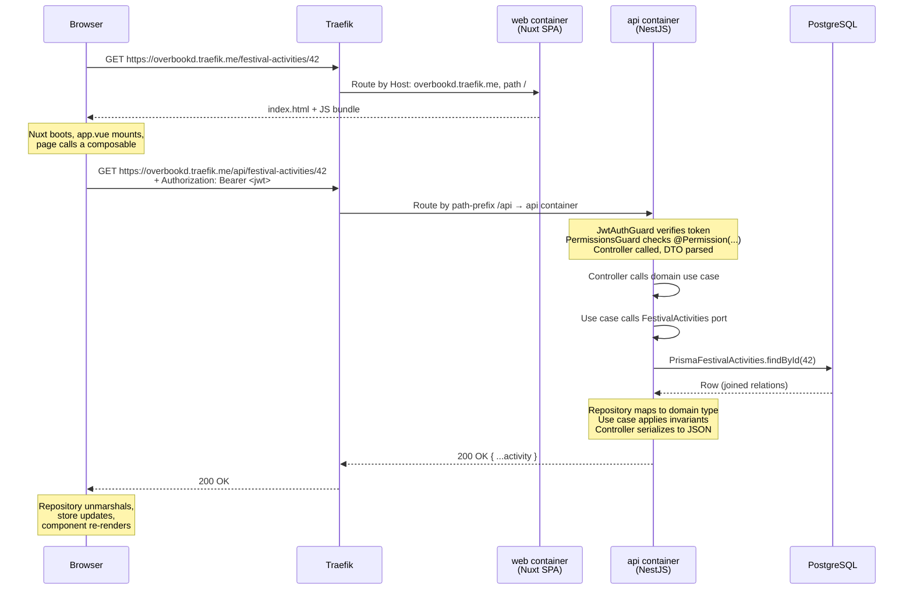

# Request lifecycle

> _What this page covers:_ A real GET request walked end-to-end — browser → Traefik → web → API → Postgres → response.
> _Who it's for:_ Anyone debugging a request that's failing somewhere along the chain.

## The whole journey

## Where each thing happens

### Traefik

`docker/docker-compose.yml` runs Traefik with these rules:
- Host `overbookd.traefik.me`, path `/api/*` → api container.
- Host `overbookd.traefik.me`, path `/adminer/*` → adminer container.
- Host `mail.traefik.me` → mail_catcher container.
- Everything else on `overbookd.traefik.me` → web container.

Traefik labels live on each service in the compose file. TLS termination happens here using the local CA cert (see [`docs/01-start-here/02-local-setup.md` → Trust the certificate](../01-start-here/02-local-setup.md#trust-the-certificate)).

### web container

Serves the Nuxt SPA. On boot it sends `index.html` and the JS bundle. Once running in the browser, the app calls back to `/api/...` via the shared HTTP client in `@overbookd/http`.

Note: the web container does **not** proxy API calls — the browser hits the API directly through Traefik.

### api container

Bootstrapped in `apps/api/src/main.ts`. Global pipes:
- `ValidationPipe` for DTO validation.
- A global exception filter (`http-exception.filter.ts`) that maps domain errors to HTTP status codes.
- Swagger setup at `/api/swagger`.

Per-route:
- `JwtAuthGuard` (decoded JWT → `req.user`) on protected endpoints.
- `PermissionsGuard` reads `@Permission(...)` metadata and checks the user's permissions.
- Controller method runs, calls a domain use case via an injected port.

### Domain layer

The use case is pure code. It calls the port (interface), gets back a domain object, applies invariants, returns a result. **No HTTP knowledge here, no Prisma knowledge.**

### Repository / adapter

Implements the domain port using `PrismaService`. Maps Prisma rows to domain types at the boundary. This is the only place that knows the database exists.

### PostgreSQL

Local: dockerized, data persisted in `docker/data/postgresql/`. Prod: managed in the `infra` repo.

## Where to look when something is wrong

| Symptom | First place to look |
|---|---|
| Browser shows a CORS or TLS error | Traefik routing / cert trust ([`02-local-setup.md`](../01-start-here/02-local-setup.md)) |
| Browser shows 401 | JWT expired or missing — check the `Authorization` header in DevTools Network |
| Browser shows 403 | The user lacks the required permission — check `@Permission(...)` on the controller and the user's team permissions |
| Browser shows 400 | DTO validation rejected the payload — the response body has the failed constraints |
| Browser shows 500 | Look at `pnpm dev:logs` for the api container — likely an unhandled domain or Prisma error |
| Browser request never reaches the API | Traefik routing or host resolution — check that `*.traefik.me` resolves |
| Endpoint returns wrong data | Set a breakpoint or `console.log` in the repository (mapper) and the use case |

## See also

- [`docs/02-architecture/api-anatomy.md`](./api-anatomy.md)
- [`docs/02-architecture/web-anatomy.md`](./web-anatomy.md)
- [`docs/05-operations/local-dev-gotchas.md`](../05-operations/local-dev-gotchas.md)

---

_Last reviewed: 2026-05_
