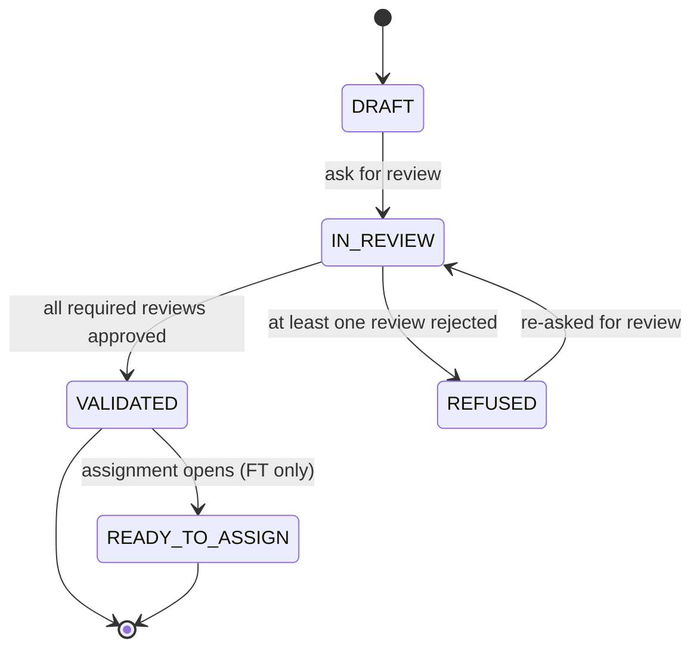

# Domain — festival-event

> _What this page covers:_ Festival activities (FA) and festival tasks (FT) — the heart of what the app manages.
> _Who it's for:_ Anyone touching `domains/festival-event` or its API/UI consumers.

<!-- DRAFT — needs validation. Extracted from the codebase; please correct any wording where it differs from how the team talks about these concepts. -->

## Purpose

The festival is, mechanically, a list of **things happening** (festival activities) and the **shifts that staff them** (festival tasks). This domain owns both, plus the lifecycle that takes them from "someone's idea" to "ready to be assigned to volunteers".

## Key concepts

| Concept | What it is |
|---|---|
| **Festival Activity (FA)** | A user-facing thing happening at the festival — a concert, workshop, food stand. Owns time windows, signage, electricity supply, contractors. |
| **Festival Task (FT)** | A volunteer-staffable shift attached to (or supporting) an FA. Has time windows, mobilizations (how many volunteers, of what teams), location, contacts. |
| **Mobilization** | An FT's "I need N volunteers (optionally from team T) covering this time window" request. |
| **Time window** | A start-end interval. FAs and FTs each have their own. |
| **Inquiry request** | An FA/FT asking for gear or signage from `logistic` / `signa`. |
| **Review** | A team's verdict on an FA/FT — approved, rejected, or yet to read. |
| **History entry** | An audit log line written each time an FA/FT changes state. |
| **Feedback** | Free-form comments left on an FA/FT. |

## Lifecycle

Both FA and FT use the same status machine:

Status codes (and their French labels) are in `constants/festival-event-constants/src/status.ts`:

| Code | French label |
|---|---|
| `DRAFT` | Brouillon |
| `IN_REVIEW` | Relecture en cours |
| `VALIDATED` | Validée |
| `REFUSED` | Refusée |
| `READY_TO_ASSIGN` | Prête pour affectation |

## Reviews

When an FA/FT is in `IN_REVIEW`, multiple teams can each leave one of:

| Code | French label | Effect |
|---|---|---|
| `REVIEWING` | À relire | Default; counts as pending |
| `APPROVED` | Approuvée | Counts toward validation |
| `REJECTED` | Rejetée | Forces the FA/FT into `REFUSED` |
| `NOT_ASKING_TO_REVIEW` | Pas de relecture | This team is opted out of reviewing |
| `WILL_NOT_REVIEW` | Ne va pas relire | Same as above, set after the fact |

The set of reviewing teams depends on the FA/FT category and content (e.g. an FA needing electricity gets reviewed by the elec team).

## FT categories

FTs are bucketed by category (`constants/festival-event-constants/src/category.ts`):

- `STATIQUE` — stationary tasks (a sign, a table)
- `BAR` — bar duties
- `MANUTENTION` — moving stuff
- `FUN` — fun shifts (entertaining the crowd)
- `RELOU` — annoying / undesirable shifts
- `COLLAGE` — postering, sticker work

Categories drive volunteer rewards and assignment heuristics.

## Use cases (in `domains/festival-event/src/festival-activity/`)

| Folder | What it does |
|---|---|
| `creation/` | Create a draft FA |
| `preparation/` | Edit an FA's sections (general info, signa, supply, inquiry, time windows, contractors) while in DRAFT or REFUSED |
| `ask-for-review/` | Move from DRAFT to IN_REVIEW |
| `reviewing/` | Apply a team's review verdict |
| `sections/` | Per-section edit logic (signa, electricity, time windows, etc.) |
| `preview-of/` | Render a compact card of an FA |

`festival-task/` mirrors the structure for FTs, with use cases tailored to mobilizations, contacts, and the move into `READY_TO_ASSIGN`.

## Where the code lives

| Layer | Path |
|---|---|
| Domain logic | [`domains/festival-event/`](../../../domains/festival-event/) |
| Constants | [`constants/festival-event-constants/`](../../../constants/festival-event-constants/) |
| API slice | [`apps/api/src/festival-event/`](../../../apps/api/src/festival-event/) |
| Prisma models | `FestivalActivity*`, `FestivalTask*`, `Contractor` in [`apps/api/prisma/schema.prisma`](../../../apps/api/prisma/schema.prisma) |
| Web pages | `apps/web/pages/...` (festival-activities and festival-tasks routes) |

## Open questions for validation

- Are the categories (`STATIQUE`, `BAR`, …) still used as-is, or has the team split them further?
- Does the lifecycle exactly match the diagram above, or does `REFUSED` allow direct edits without going back through `DRAFT`?
- Who decides "this FT is ready to assign" — is `READY_TO_ASSIGN` automatic on validation, or a manual move?

## See also

- [`docs/03-business/domains/assignment.md`](./assignment.md) — what happens after `READY_TO_ASSIGN`
- [`docs/03-business/domains/logistic.md`](./logistic.md) — gear inquiries
- [`docs/03-business/domains/signa.md`](./signa.md) — signage inquiries
- [`docs/02-architecture/api-anatomy.md`](../../02-architecture/api-anatomy.md)

---

_Last reviewed: 2026-05 — DRAFT_
