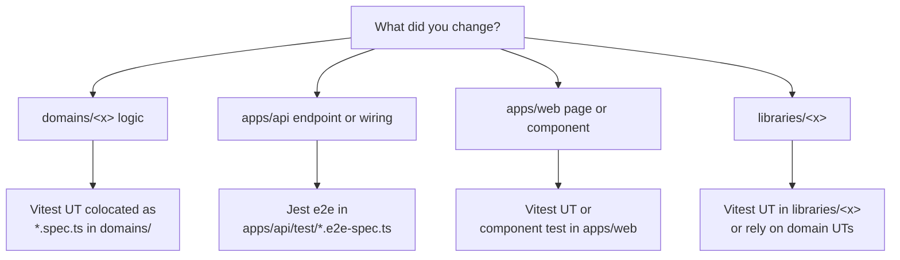

# Testing

> _What this page covers:_ Where each kind of test lives — domain UTs (Vitest), API e2e (Jest), web tests.
> _Who it's for:_ Anyone wondering "where do I write the test for this change".

## The decision tree



## Layers and tools

| Layer | Tool | Where | Required? |
|---|---|---|---|
| `constants/` | — | — | No (no logic) |
| `libraries/` | Vitest | colocated `*.spec.ts` | Optional (often tested via domains) |
| `domains/` | Vitest | colocated `*.spec.ts` | **Mandatory** |
| `utils/` | — | — | No (no logic) |
| `apps/api` | Vitest (UT) + Jest (e2e) | UT colocated; e2e in `apps/api/test/` | UT optional (push to domain); e2e for non-trivial endpoints |
| `apps/web` | Vitest | colocated | Optional but encouraged for stores and composables |

The mandatory bar lives in `domains/` because that's where business logic lives. Anything else is a force multiplier.

## Vitest (UT)

Root config: `vitest.config.ts` (just sets reporter and chai config — packages extend it).

```bash
# All UTs in one package
pnpm --filter @overbookd/festival-event run test:unit

# A single spec file
pnpm --filter @overbookd/festival-event run test:unit -- src/festival-activity/creation/creation.spec.ts

# Filter by test name
pnpm --filter @overbookd/festival-event run test:unit -- -t "draft creation"

# CI mode (no watch, exits when done)
pnpm --filter @overbookd/festival-event run test:unit:ci
```

### Anatomy of a domain UT

```ts
import { describe, it, expect } from "vitest";
import { CreateFestivalActivity } from "./creation";
import { InMemoryFestivalActivities } from "../festival-activity.fake";

describe("Creating a festival activity", () => {
  it("starts in draft state", () => {
    const repo = new InMemoryFestivalActivities();
    const useCase = new CreateFestivalActivity(repo);
    const fa = useCase.create({ name: "Crêpes party" });
    expect(fa.status).toBe("DRAFT");
  });
});
```

Three patterns to internalize:

1. **Use the domain's fakes**, not Vitest mocks. The fakes live alongside the code (`*.fake.ts`).
2. **Test through use cases**, not the aggregate type directly. Use cases encode user-facing behavior.
3. **Arrange / Act / Assert** structure. Keeps tests readable.

## Jest (API e2e)

Config: `apps/api/test/jest-e2e.json`. Tests use supertest to hit a real Nest app backed by a real (test) database.

```bash
pnpm --filter @overbookd/api run test:e2e

# Filter by test name
pnpm --filter @overbookd/api run test:e2e -- --testNamePattern="login"
```

### Anatomy of an e2e

```ts
describe("POST /festival-activities", () => {
  it("creates a draft when called by an instigator", async () => {
    const token = await loginAs("instigator-user");
    const res = await request(app.getHttpServer())
      .post("/festival-activities")
      .set("Authorization", `Bearer ${token}`)
      .send({ name: "Crêpes party" });
    expect(res.status).toBe(201);
    expect(res.body.status).toBe("DRAFT");
  });
});
```

Things to test at this layer:
- Auth and permission gates.
- DTO validation (`400` for bad payloads).
- Wiring (the response shape matches the controller's declared type).
- Side effects across modules (e.g. an event published by domain A is observed by domain B).

Things **not** to test at this layer:
- Domain logic. That's UT territory. e2e is slower, harder to reason about, and shouldn't be load-bearing for invariants.

## Component / web tests

`apps/web` uses Vitest. Tests typically cover:

- Pinia stores (state transitions, action effects).
- Composables (reactive behavior).
- Repositories (URL construction, error mapping).

Vue component tests are encouraged for non-trivial components but not required for plain layout components.

## Running all tests

```bash
pnpm --recursive run test:unit:ci
pnpm --filter @overbookd/api run test:e2e
```

The CI pipeline runs both as separate jobs.

## See also

- [`docs/04-conventions/code-style.md`](./code-style.md)
- [`docs/04-conventions/adding-a-domain.md`](./adding-a-domain.md) — UT setup for a new domain
- [Vitest documentation](https://vitest.dev/)
- [Jest documentation](https://jestjs.io/)

---

_Last reviewed: 2026-05_
