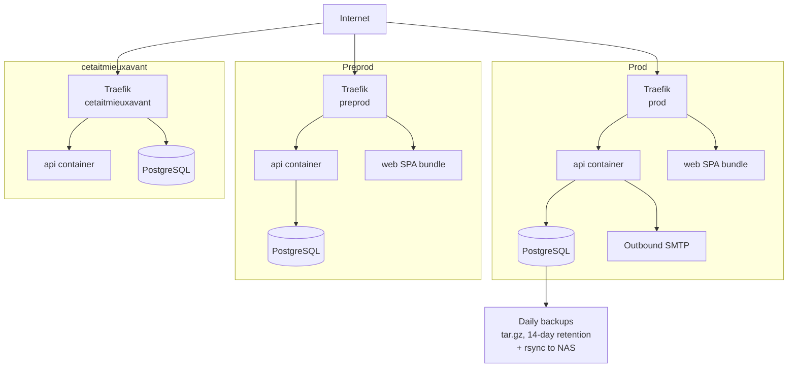

# Deployment topology

> _What this page covers:_ How the prod / preprod / cetaitmieuxavant environments are structured, what Traefik does, and where the actual configs live.
> _Who it's for:_ Anyone investigating a prod incident or wondering "where does this thing actually run".

> ⚠️ The deployment configs themselves (compose files, Traefik routing rules, secrets, backup cron, monitoring) live in the separate [`24-heures-insa/infra`](https://gitlab.com/24-heures-insa/infra) GitLab repo. This page describes the **shape**; for actual configs go there.

## Environments

| Name | Purpose | Hostname | Source |
|---|---|---|---|
| **prod** | Live festival management | `overbookd.24heures.org` (or similar) | `main` of `overbookd-mono` |
| **preprod** | Staging for the team to validate releases | `preprod.overbookd.24heures.org` (or similar) | `main` of `overbookd-mono`, often slightly ahead |
| **cetaitmieuxavant** | "It was better before" — historical / archive instance | `cetaitmieuxavant.24heures.org` (or similar) | Historical snapshots |
| **local dev** | Your machine | `*.traefik.me` | Your working tree |

Hostnames are illustrative — confirm in the [`infra` repo](https://gitlab.com/24-heures-insa/infra) for the current values.

## Topology diagram

Each environment is a single Docker Compose stack. Traefik fronts each stack and routes:

- `/api/*` → api container
- `/adminer/*` → adminer container (if exposed)
- everything else → web container (static SPA bundle)

This mirrors the local dev topology (see [`docs/02-architecture/request-lifecycle.md`](../02-architecture/request-lifecycle.md)) — that's intentional, so what you debug locally maps directly to what runs in prod.

## Where each thing actually lives

| What | Where |
|---|---|
| `docker-compose.yml` for prod / preprod / cetaitmieuxavant | [`infra` repo](https://gitlab.com/24-heures-insa/infra) |
| Traefik labels and TLS certs | `infra` repo `data/traefik/` |
| Production secrets (env files) | `infra` repo (not committed in plain text — see the team's secret-management process) |
| Backup script (`backups.sh`) | `infra` repo |
| Server provisioning scripts | `infra` repo |
| The application code (api, web, domains, …) | _this_ repo (`overbookd-mono`) |

## Deploy flow

The CI pipeline (`.gitlab-ci.yml` in this repo) builds and tests on every push. Deployments are triggered by pipelines/jobs configured in the `infra` repo (typically: tag a release here, the infra side pulls the new image and recreates the compose stack).

Concretely, the release flow is:

1. A maintainer runs `pnpm release:patch` (or `release:minor` / `release:major`). See [`release-process.md`](./release-process.md).
2. `commit-and-tag-version` updates package versions, generates a CHANGELOG, creates a tag.
3. The maintainer pushes the tag.
4. CI builds container images.
5. The infra side deploys (manual or automated, depending on the environment).

## Logs, monitoring, alerts

These are operated from the `infra` repo. If you're on-call or investigating an incident, start there.

## See also

- [`docs/05-operations/database.md`](./database.md) — backups and restore
- [`docs/05-operations/release-process.md`](./release-process.md) — how releases are cut
- [`docs/02-architecture/request-lifecycle.md`](../02-architecture/request-lifecycle.md) — the same topology for local dev
- [`24-heures-insa/infra`](https://gitlab.com/24-heures-insa/infra) — the actual configs

---

_Last reviewed: 2026-05_
