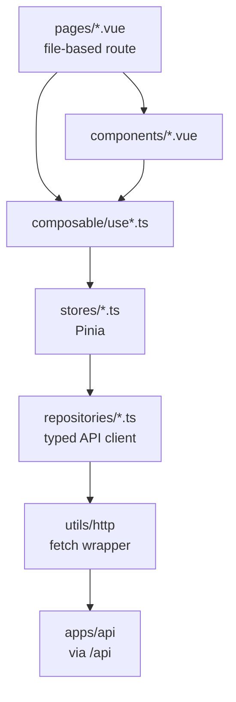

# Web anatomy

> _What this page covers:_ How `apps/web` is wired — Nuxt 4 SPA structure, components, composables, stores, and the API client.
> _Who it's for:_ Anyone touching the frontend.

## The big picture



Two important rules:

1. **Pages and components are dumb.** They render reactive state and emit user intent. They don't fetch.
2. **Repositories are the only place that talks to the API.** Everything else goes through stores.

## Top-level layout

```text
apps/web/
├── app.vue                  # Root component
├── error.vue                # Global error page
├── nuxt.config.ts           # Nuxt configuration (ssr: false)
├── pages/                   # File-based routing (each file = a route)
├── components/              # Reusable UI components
├── composable/              # Vue composables (use*.ts)
├── stores/                  # Pinia stores
├── repositories/            # Typed wrappers around the API client
├── domain/                  # Web-side mirrors of domain types
├── layouts/                 # Page layouts (default, public, …)
├── middleware/              # Per-route auth and permission gates
├── plugins/                 # Nuxt plugins
├── assets/                  # Imported CSS/SVG/etc.
├── public/                  # Static assets served as-is
└── utils/                   # Pure helpers (no Vue dependency)
```

## Each layer in detail

### `pages/`

File-based routing. A file at `pages/foo/[id].vue` is the route `/foo/:id`. Pages should be thin: pull state from stores via composables, render, dispatch user actions.

### `components/`

Reusable UI. Avoid component-level fetching — accept props, emit events. If a component needs data, the page or its composable supplies it.

### `composable/`

Vue 3 composables, named `useSomething.ts`. The bridge between pages/components and stores. A composable does:

- Wraps reactive state from a store with view-friendly accessors.
- Owns small UI-specific reactivity (form state, modal open/close).
- Triggers store actions on user events.

### `stores/`

[Pinia](https://pinia.vuejs.org/) stores. The single source of truth for client-side state. Each store:

- Holds reactive state.
- Exposes actions that orchestrate the right repository calls.
- Caches data when sensible — composables should not refetch on every component mount.

### `repositories/`

The only layer that calls the API. Each repository:

- Returns typed promises whose types come from `apps/web/domain/` (web-side mirror of the domain types).
- Uses the shared HTTP client from `@overbookd/http` (`utils/http`).
- Throws / rejects on non-2xx — let the store handle errors.

### `domain/`

Web-side type definitions that mirror the API's response shape. Often imported from `@overbookd/<domain>` directly when the domain types are serializable; otherwise re-declared here to avoid web-side type leaks into the SSR-less bundle.

### `layouts/` and `middleware/`

`layouts/` defines the chrome (header, sidebar) around pages. `middleware/` enforces auth and permission checks per route.

## Why SPA (`ssr: false`)

The app is configured `ssr: false` in `nuxt.config.ts`. There is no Node SSR runtime in production — the API serves a static bundle. Reasons:

- The app is auth-walled — there's nothing useful to pre-render.
- It simplifies deployment (one less long-running process).
- It removes the SSR/hydration mismatch class of bugs.

⚠️ **Nuxt is currently pinned at ≤ 4.4.2** because 4.4.4 broke SPAs (see [nuxt/nuxt#34957](https://github.com/nuxt/nuxt/issues/34957)). Don't bump it without verifying the dev server still serves [https://overbookd.traefik.me](https://overbookd.traefik.me) with HTTP 200.

## Linting and typing

```bash
pnpm --filter @overbookd/web run lint
pnpm --filter @overbookd/web run test:unit
```

The web app has its own `tsconfig.json` extending the workspace root.

## See also

- [`docs/conventions/adding-a-web-page.md`](../conventions/adding-a-web-page.md)
- [`docs/architecture/request-lifecycle.md`](./request-lifecycle.md)
- [Nuxt 4 docs](https://nuxt.com/docs/getting-started/introduction)

---

_Last reviewed: 2026-05_
