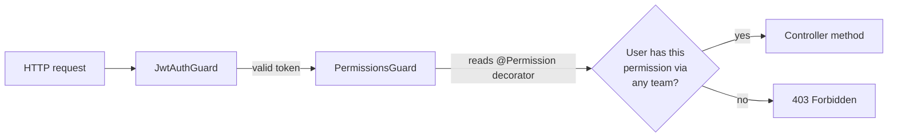

# Domain — access-manager

> _What this page covers:_ Roles, permissions, and teams — who is allowed to do what.
> _Who it's for:_ Anyone touching `domains/access-manager` or adding a permission check.

<!-- DRAFT — needs validation. Extracted from the codebase; please correct any wording where it differs from how the team talks about these concepts. -->

## Purpose

Access control across the entire app. Every protected endpoint, every permission-gated UI route, ultimately resolves through this domain. The model is **team-based**: permissions are granted to teams, users belong to teams, and a user has a permission iff at least one of their teams grants it.

## Key concepts

| Concept | What it is |
|---|---|
| **Team** | A named group of users (e.g. `humains`, `comm`, `logistique`). |
| **User-team** | The membership link between a user and a team. |
| **Permission** | A named capability (e.g. `WRITE_FA`, `MANAGE_PERMISSIONS`). Stored as a string-codified constant. |
| **Team-permission** | The link granting a permission to a team. |
| **Role** | Informal — used colloquially to mean "the set of permissions a user has by virtue of their teams". |

## Use cases (in `domains/access-manager/src/`)

| Folder | What it does |
|---|---|
| `grant-permission/` | Assign a permission to a team |
| `revoke-permission/` | Remove a permission from a team |
| `join-teams/` | Add a user to one or more teams |
| `leave-team/` | Remove a user from a team |

## How auth is enforced

API side: `JwtAuthGuard` validates the JWT and populates `req.user`. `PermissionsGuard` reads the `@Permission(...)` decorator on the route and checks against `req.user`'s computed permissions.

Web side: a similar check in `apps/web/middleware/` decides whether a route is reachable.

## Where the code lives

| Layer | Path |
|---|---|
| Domain logic | [`domains/access-manager/`](../../../domains/access-manager/) |
| Permission constants | [`constants/permission/`](../../../constants/permission/) |
| Team constants | [`constants/team-constants/`](../../../constants/team-constants/) |
| API slices | `apps/api/src/access-manager/`, `apps/api/src/permission/`, `apps/api/src/team/` |
| Prisma models | `Team`, `UserTeam`, `Permission`, `TeamPermission`, `MembershipApplication` in [`schema.prisma`](../../../apps/api/prisma/schema.prisma) |

## Open questions for validation

- Are teams hierarchical (e.g. "humains" includes "comm")? The schema suggests flat with explicit memberships.
- Is there a notion of "admin" beyond having `MANAGE_PERMISSIONS`?
- How does the user UI express "you don't have this permission" — silent hide vs explicit error?

## See also

- [`docs/architecture/api-anatomy.md`](../../architecture/api-anatomy.md) — how the guards plug into NestJS
- [`docs/conventions/adding-an-api-endpoint.md`](../../conventions/adding-an-api-endpoint.md) — how to add a `@Permission(...)` to a new route

---

_Last reviewed: 2026-05 — DRAFT_
