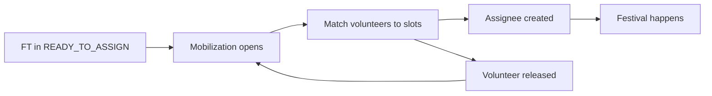

# Domain — assignment

> _What this page covers:_ Assigning volunteers to festival-task (FT) timeslots during the festival.
> _Who it's for:_ Anyone touching `domains/assignment` or its API/UI consumers.

<!-- DRAFT — needs validation. Extracted from the codebase; please correct any wording where it differs from how the team talks about these concepts. -->

## Purpose

Once an FT is `READY_TO_ASSIGN` (see [festival-event](./festival-event.md)), this domain decides **which volunteer staffs which mobilization slot**. Assignment honors:

- The volunteer's declared availability.
- Team membership (an FT mobilization may require a specific team).
- Volunteer preferences (back-to-back vs spread out, etc.).
- Friend links — the engine prefers putting friends together.
- Hard constraints — break periods, double-booking, etc.

## Key concepts

| Concept | What it is |
|---|---|
| **Assignment** | The act of pairing a specific volunteer with a specific FT mobilization slot. |
| **Assignee** | A volunteer assigned to a mobilization. |
| **Candidate teams** | The set of teams whose members are eligible for a given mobilization. |
| **Volunteer** (assignment-side) | A view of the user shaped for the assignment problem (id, teams, friends, breaks). Distinct from the volunteer in `registration` or `personal-account`. |
| **Friend** | Two volunteers linked so the engine tries to assign them to the same FT. |
| **Break period** | A volunteer-declared rest interval — assignment refuses to schedule across it. |
| **Assignment preference** | Volunteer-side preference: `NO_PREF` / `STACKED` / `FRAGMENTED` / `NO_REST`. |

## Use cases (in `domains/assignment/src/`)

| Folder | What it does |
|---|---|
| `assign-task-to-volunteer/` | "Given this FT, find a volunteer to fill it." |
| `assign-volunteer-to-task/` | "Given this volunteer, find an FT to fill them with." |
| `break-periods/` | Manage volunteer breaks |
| `count-assignees-in-team.ts` | Aggregate how many of team T have been assigned to a mobilization |
| `candidate-teams.ts` | Compute which teams can staff a given mobilization |
| `friends.ts` | Friend-link logic |

The two `assign-*` directions exist because the UI offers both flows: the team lead sees "FT → who fits" and the volunteer sees "available FTs for me".

## Lifecycle

A volunteer can be released from an assignment (they cancel, or a team lead reassigns) — the slot reopens.

## Where the code lives

| Layer | Path |
|---|---|
| Domain logic | [`domains/assignment/`](../../../domains/assignment/) |
| API slice | [`apps/api/src/assignment/`](../../../apps/api/src/assignment/) |
| Prisma models | `Assignment`, `Assignee`, `FestivalTaskMobilization*` in [`schema.prisma`](../../../apps/api/prisma/schema.prisma) |
| Web pages | `apps/web/pages/...` (assignment routes) |

## Open questions for validation

- Is there an actual matching algorithm, or is it driven by a UI where humans pick? (The codebase suggests humans pick, with the engine surfacing candidates.)
- How are conflicts resolved (volunteer assigned to two overlapping FTs)?
- What's the relationship between `Assignment` (the model) and `Assignee` — one-to-many?

## See also

- [`docs/business/domains/festival-event.md`](./festival-event.md) — what produces FTs ready for assignment
- [`docs/business/domains/volunteer-availability.md`](./volunteer-availability.md) — where the input availability comes from
- [`docs/business/domains/access-manager.md`](./access-manager.md) — teams and their permissions

---

_Last reviewed: 2026-05 — DRAFT_
