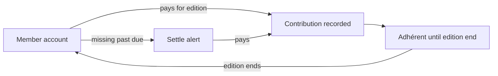

# Domain — contribution

> _What this page covers:_ Volunteer contributions (membership fees, etc.) and how they're tracked.
> _Who it's for:_ Anyone touching `domains/contribution` or its API/UI consumers.

<!-- DRAFT — needs validation. Extracted from the codebase; please correct any wording where it differs from how the team talks about these concepts. -->

## Purpose

To become an "adhérent" — a member with full association rights — a volunteer pays a yearly contribution. This domain tracks who's paid for which edition, processes payments, and surfaces "you owe a contribution" alerts.

This is **distinct from** `personal-account`, which tracks intra-festival transactions.

## Key concepts

| Concept | What it is |
|---|---|
| **Contribution** | A signed, dated payment by one user for a given edition / period. |
| **Adhérent** | A user whose contribution is paid for the current period. |
| **Settle alerting** | Notifications sent to users who haven't yet contributed. |

## Use cases (in `domains/contribution/src/`)

| Folder / file | What it does |
|---|---|
| `pay-contribution/` | Record a contribution payment for a user |
| `edit-contribution/` | Modify an existing contribution record |
| `settle-alerting/` | Compute who is missing a contribution; emit reminders |
| `contribution.ts`, `contribution.error.ts` | Aggregate and domain errors |

## Lifecycle

## Where the code lives

| Layer | Path |
|---|---|
| Domain logic | [`domains/contribution/`](../../../domains/contribution/) |
| API slice | [`apps/api/src/contribution/`](../../../apps/api/src/contribution/) |
| Prisma model | `Contribution` in [`schema.prisma`](../../../apps/api/prisma/schema.prisma) |

## Open questions for validation

- Is the contribution annual, per-edition, or both?
- Who can record a contribution — the user themselves, or only an admin?
- How does the system handle reimbursements?

## See also

- [`docs/business/domains/personal-account.md`](./personal-account.md) — separate intra-festival economy
- [`docs/business/domains/registration.md`](./registration.md) — becoming a member in the first place

---

_Last reviewed: 2026-05 — DRAFT_
