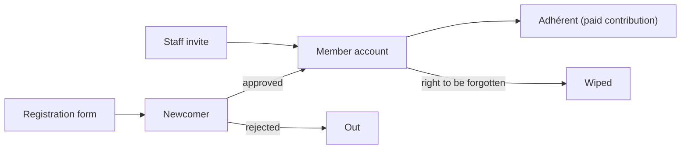

# Domain — registration

> _What this page covers:_ How volunteers (and other roles) sign up and onboard.
> _Who it's for:_ Anyone touching `domains/registration` or its API/UI consumers.

<!-- DRAFT — needs validation. Extracted from the codebase; please correct any wording where it differs from how the team talks about these concepts. -->

## Purpose

The "front door" of the application. Handles a person's path from "I'd like to join" to "I have an account and a profile".

## Key concepts

| Concept | What it is |
|---|---|
| **Newcomer** | A person who has filled the registration form but does not yet have an active account. |
| **Register form** | The questions answered at signup — phone number, identity, motivations, etc. |
| **Membership application** | A formal request to be added to the system as a recognized member. May require approval. |
| **Phone number** | A first-class type — validated and stored in normalized form. |
| **Forget member** | The "right to be forgotten" workflow — wipes a member's personal data. |
| **Invite staff** | Direct invitation flow for staff (long-term association members), bypassing the public form. |

## Use cases (in `domains/registration/src/`)

| Folder / file | What it does |
|---|---|
| `enroll/` | Flow for a newcomer to become a registered member |
| `register-newcomer.ts` | Submit the public registration form |
| `membership-application/` | Track and process applications |
| `invite-staff/` | Staff-direct invitation |
| `forget-member/` | Wipe a member's data on request |
| `phone-number/` | Phone validation and normalization |
| `register-form/` | Form definition and validation |

## Lifecycle

The path through `Newcomer` is the public signup; staff invites land directly in `Member`.

## Where the code lives

| Layer | Path |
|---|---|
| Domain logic | [`domains/registration/`](../../../domains/registration/) |
| API slice | [`apps/api/src/registration/`](../../../apps/api/src/registration/) (or similar) |
| Prisma models | `User`, `MembershipApplication`, `Notification` in [`schema.prisma`](../../../apps/api/prisma/schema.prisma) |

## Open questions for validation

- Is the "newcomer" stage gated by approval, or auto-promoted to "member" on form submission?
- Where does staff vs. volunteer distinction first appear — at registration or later via teams?
- What triggers "forget-member" — user request, GDPR deadline, both?

## See also

- [`docs/business/domains/access-manager.md`](./access-manager.md) — teams and permissions assigned after registration
- [`docs/business/domains/contribution.md`](./contribution.md) — paying to become an adhérent

---

_Last reviewed: 2026-05 — DRAFT_
