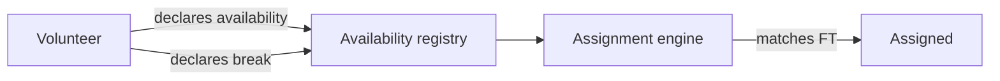

# Domain — volunteer-availability

> _What this page covers:_ When volunteers declare they can work — the input to the assignment domain.
> _Who it's for:_ Anyone touching `domains/volunteer-availability` or its API/UI consumers.

<!-- DRAFT — needs validation. Extracted from the codebase; please correct any wording where it differs from how the team talks about these concepts. -->

## Purpose

A volunteer can't be assigned to a festival task without first declaring when they're available. This domain owns those declarations and turns them into a queryable availability schedule.

## Key concepts

| Concept | What it is |
|---|---|
| **Availability** | A single time window during which the volunteer is willing to work. |
| **Shift** | A fixed-duration unit (e.g. 6h slots). Availabilities are typically expressed as shifts. |
| **Period orchestrator** | The piece that merges overlapping availabilities and breaks into a coherent schedule per volunteer. |
| **Registry** | The aggregated state per volunteer — "what does volunteer V's availability look like across the festival". |
| **Break period** | A volunteer-declared rest interval. Subtracts from availability. |

## Use cases (in `domains/volunteer-availability/src/`)

| File / folder | What it does |
|---|---|
| `volunteer-availability.ts` | The aggregate type and constructors |
| `volunteer-availability.registery.ts` | Registry of all availabilities for a volunteer (note: typo in the codebase — "registery" not "registry") |
| `availabilities.ts` | Helpers to compose multiple availabilities |
| `period-orchestrator.ts` | Merge overlapping windows, subtract breaks |
| `select.ts` | Selection / filtering of availabilities |
| `shift.constant.ts` | Shift definitions (durations, etc.) |

## Lifecycle

## Where the code lives

| Layer | Path |
|---|---|
| Domain logic | [`domains/volunteer-availability/`](../../../domains/volunteer-availability/) |
| API slice | [`apps/api/src/volunteer-availability/`](../../../apps/api/src/volunteer-availability/) |
| Prisma models | `VolunteerAvailability`, `BreakPeriod` in [`schema.prisma`](../../../apps/api/prisma/schema.prisma) |

## Open questions for validation

- Are shifts strictly fixed-duration or can volunteers declare arbitrary windows?
- What's the cutoff for editing availability (e.g. lock 24h before festival)?
- Are break periods always after-the-fact additions, or can they be pre-declared?

## See also

- [`docs/business/domains/assignment.md`](./assignment.md) — what consumes this data
- [`docs/business/domains/festival-event.md`](./festival-event.md) — what FTs need to be matched against

---

_Last reviewed: 2026-05 — DRAFT_
