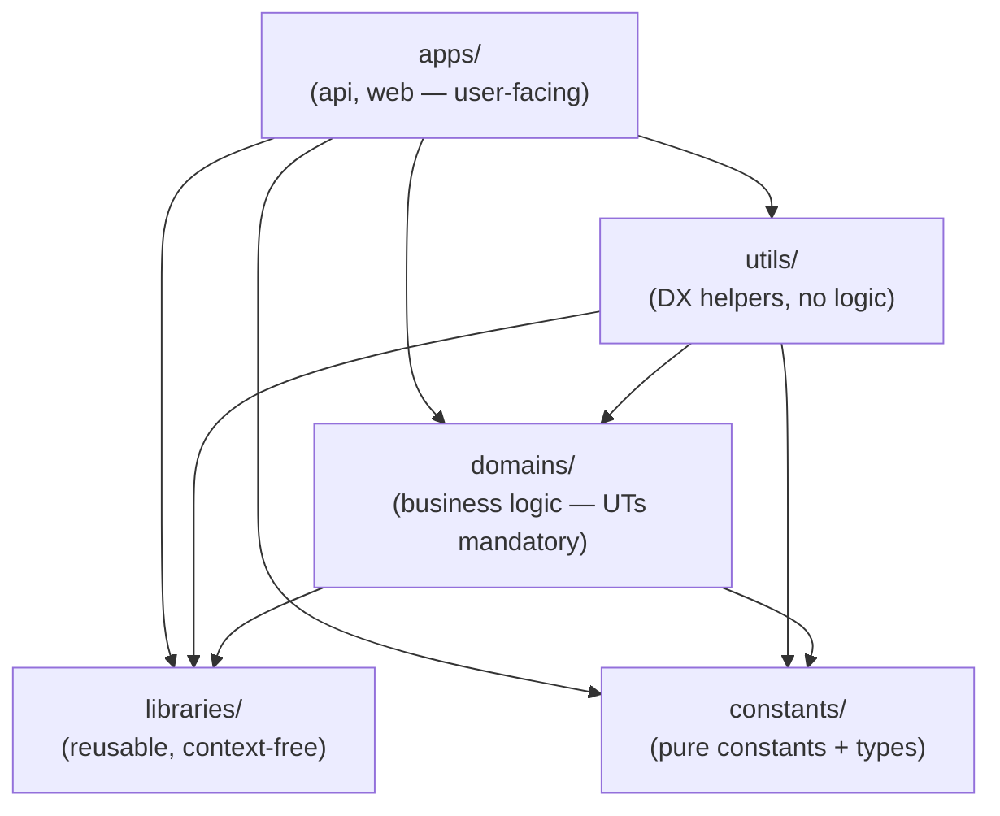

# 3. Repo tour

> _What this page covers:_ A 5-minute walk through the layered monorepo so the file tree stops looking like noise.
> _Who it's for:_ Anyone who has the app running locally and wants the lay of the land.

## Top-level structure

```text
overbookd-mono/
├── apps/             # Things end users hit (api, web)
├── domains/          # Business logic, one bounded context per folder
├── libraries/        # Reusable, context-free logic (csv, time, money, …)
├── constants/        # Pure constants + their types, scoped per context
├── utils/            # Dev-experience helpers for apps (no business logic)
├── docker/           # Local dev orchestration (compose, Dockerfile, Traefik)
├── tools/            # One-off scripts (Python migrations, etc.)
├── docs/             # ← you are here
├── package.json      # Root scripts (pnpm dev:*, db:*, lint, format, …)
└── pnpm-workspace.yaml
```

Each top-level folder corresponds to a **layer** with strict import rules. The split is deliberate and load-bearing — see [`docs/architecture/dependency-hierarchy.md`](../architecture/dependency-hierarchy.md) for the deep dive.

## The layering, in one diagram



Read the arrows as "imports from". Two non-obvious rules:

- **`libraries/` cannot import anything**, not even `constants/`.
- **`constants/` cannot import anything**.

This is what keeps shared code from accidentally absorbing app-specific assumptions.

## What lives where

| Layer | Examples in this repo | Tests |
|---|---|---|
| `constants/` | `festival-event-constants`, `permission`, `team-constants`, `web-page` | none (no logic) |
| `libraries/` | `csv`, `time`, `money`, `list`, `slugify`, `geo-location`, `pdf-book`, `event` | optional UT |
| `domains/` | `festival-event`, `assignment`, `charisma`, `signa`, `registration`, `logistic`, `contribution`, `personal-account`, `volunteer-availability`, `access-manager` | **mandatory UT** |
| `utils/` | `alerts`, `configuration`, `domain-events`, `http`, `team`, `user` | none (no logic) |
| `apps/` | `apps/api` (NestJS), `apps/web` (Nuxt 4 SPA) | UT + e2e |

Each package is published in the workspace as `@overbookd/<name>` (e.g. `@overbookd/festival-event`).

## Anatomy of a domain

`domains/festival-event/` is the largest and most representative domain. Open it:

```text
domains/festival-event/
├── package.json
├── tsconfig.json
└── src/
    ├── index.ts
    ├── festival-event.ts
    ├── common/
    ├── festival-activity/    ← the canonical example folder
    │   ├── creation/
    │   │   ├── creation.ts
    │   │   └── creation.spec.ts   ← UT colocated with the code it tests
    │   ├── reviewing/
    │   ├── preparation/
    │   ├── ask-for-review/
    │   ├── sections/
    │   ├── festival-activity.ts
    │   ├── festival-activity.factory.ts
    │   ├── festival-activity.fake.ts   ← test doubles live in the domain
    │   ├── festival-activity.error.ts
    │   └── festival-activity.event.ts
    └── festival-task/
```

Two patterns to internalize:

1. **Use cases as folders.** `creation/`, `reviewing/`, `preparation/` each contain the code _and_ the spec for one user-facing scenario.
2. **Specs are colocated** (`*.spec.ts` next to the code, not in a separate `tests/` tree).

Domain logic gets exercised through these UTs — that's the project's stated invariant.

## How a domain reaches the user: API side

The `apps/api/` layer wraps each domain in a NestJS module. Each slice mirrors a domain folder, e.g.:

```text
apps/api/src/
├── app.module.ts            # Root index — imports every <slice>.module.ts
├── main.ts
├── access-manager/
├── assignment/
├── charisma-event/
├── festival-event/
│   ├── festival-event.module.ts   # Wires the domain into NestJS DI
│   ├── *.controller.ts             # HTTP routes
│   ├── *.dto.ts                    # Validation + Swagger schema
│   └── *.repository.ts             # Persistence adapter (Prisma)
├── logistic/
├── signa/
├── permission/
├── ...
└── prisma/                  # Schema + migrations
```

The pattern: a controller validates the DTO, hands a domain object to a use case from `@overbookd/<domain>`, lets the domain return a result (or throw a domain error), and serializes the response. See [`docs/architecture/api-anatomy.md`](../architecture/api-anatomy.md) for the full breakdown.

## How a domain reaches the user: Web side

`apps/web/` is a Nuxt 4 SPA (`ssr: false`). Top-level layout:

```text
apps/web/
├── app.vue                  # Root component
├── nuxt.config.ts
├── pages/                   # File-based routing
├── components/
├── composable/              # Vue composables (use*)
├── stores/                  # Pinia stores
├── repositories/            # Typed wrappers around the API client
├── domain/                  # Web-side mirrors of domain types
├── layouts/
├── middleware/              # Auth, permissions, etc.
└── plugins/
```

A page calls a composable, which calls a store, which calls a repository, which talks to the API. See [`docs/architecture/web-anatomy.md`](../architecture/web-anatomy.md) for the full breakdown.

## What's next

Move on to [`04-first-feature.md`](./04-first-feature.md) — a guided walkthrough where you actually change something.

## See also

- [`docs/architecture/dependency-hierarchy.md`](../architecture/dependency-hierarchy.md)
- [`docs/architecture/domain-driven-layout.md`](../architecture/domain-driven-layout.md)
- [`docs/business/`](../business/README.md) — what each domain represents in festival terms

---

_Last reviewed: 2026-05_
